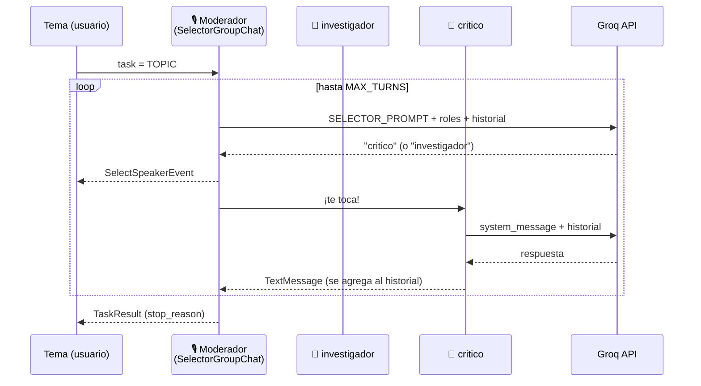

# Clase 01 — Debate multi-agente con AutoGen + Groq

> 📍 Este es el **ejemplo armado en clase**. Para el recorrido completo por las capacidades de
> AutoGen, volvé al [README principal](../README.md) y mirá [`practicas/`](../practicas/).

Proyecto **educativo** para aprender cómo funciona un *group chat* de agentes con
[AutoGen](https://microsoft.github.io/autogen/): dos agentes debaten sobre una noticia real y un
**moderador** (el *Group Chat Manager*) decide, turno a turno y según el contexto, quién habla.

```
Tema del día ─► 🎙️ Moderador lee el historial y elige ─► 🔬 investigador  ó  🧐 critico habla
                         ▲                                              │
                         └──────────── su respuesta se suma al historial ┘
                                   (se repite hasta MAX_TURNS)
```

## 🎯 Qué vas a aprender

1. Qué es un **group chat** de agentes y en qué se diferencia de hablar con un solo LLM.
2. Cómo un **moderador basado en LLM** elige al próximo orador (selección dinámica) en lugar de
   seguir un orden fijo (*round-robin*).
3. Cómo darle **personalidad y rol** a cada agente con `system_message` y `description`.
4. Cómo conectar AutoGen a un proveedor **compatible con la API de OpenAI** (Groq) usando su capa
   gratuita.
5. Cómo leer el **stream de eventos** de un equipo de agentes (mensajes y decisiones del moderador).
6. Por qué los LLMs **alucinan datos** y por qué un "crítico" hecho con el mismo modelo no alcanza
   para detectarlo.

> 💡 Si nunca usaste AutoGen, empezá por [conceptos.md](conceptos.md) y después volvé acá.

## 🧩 Los tres roles

| Rol | Nombre en el código | Qué hace | Modelo por defecto |
|---|---|---|---|
| 🔬 Investigador | `investigador` | Propone datos, cifras y argumentos sobre el tema. | `openai/gpt-oss-120b` |
| 🧐 Crítico | `critico` | Cuestiona al investigador: pide fuentes, busca sesgos y contraejemplos. | `openai/gpt-oss-120b` |
| 🎙️ Moderador | *Group Chat Manager* de `SelectorGroupChat` | Lee el historial y elige quién habla a continuación. No opina. | `openai/gpt-oss-20b` |

El moderador **no es un `AssistantAgent`**: es el *manager* interno que crea `SelectorGroupChat`,
al que le pasamos su propio `model_client` y su propio prompt (`SELECTOR_PROMPT`).

## 🏗️ Arquitectura



## ✅ Requisitos

- **Python 3.12 o 3.13** (AutoGen todavía no soporta 3.14 en este proyecto).
- **[Poetry](https://python-poetry.org/) 2.x** para gestionar dependencias.
- Una **API key gratuita de Groq**: <https://console.groq.com/keys> (empieza con `gsk_`).

## 🚀 Puesta en marcha paso a paso

### 1. Instalar dependencias

```bash
poetry install
```

Esto crea el entorno virtual en `.venv/` e instala `autogen-agentchat`, `autogen-ext[openai]` y
`python-dotenv`.

> ⚠️ **Red corporativa:** el `pyproject.toml` usa como fuente primaria el mirror interno
> `pypi.artifacts.furycloud.io`, que requiere estar conectado a la **VPN**. Si ves un error `403`
> o `could not resolve host`, mirá [docs/problemas-frecuentes.md](../docs/problemas-frecuentes.md).

### 2. Configurar la API key

```bash
cp .env.example .env
# Editá .env y reemplazá el valor por tu key real
```

El archivo `.env` está en `.gitignore`: **nunca** lo subas al repositorio.

### 3. Ejecutar el debate

```bash
poetry run python clase-01-debate/debate_groupchat.py
```

Vas a ver el debate en la terminal y, al terminar, se guarda en `transcript.md`.

## 📖 Cómo leer la salida

```markdown
> 🎙️ **Moderador** da la palabra a → `critico`     ← decisión del Group Chat Manager

## Turno 2 — critico                               ← mensaje de un agente
Tu exposición tiene datos útiles, pero...

---
*Fin: Maximum number of turns 5 reached.*         ← motivo de fin (TaskResult.stop_reason)
```

- Cada **línea del moderador** es un `SelectSpeakerEvent`: la prueba de que hubo una decisión
  del LLM antes de cada turno.
- Si el moderador alterna siempre investigador ↔ crítico, **no significa que sea round-robin**:
  con estas reglas, cada respuesta suele dejar algo pendiente para el otro. Probá el
  [ejercicio 2](ejercicios.md#ejercicio-2--forzar-una-decisión-no-alternada) para verlo elegir distinto.

En [transcript.md](transcript.md) hay una corrida de ejemplo completa.

## 🗂️ Estructura del proyecto

```
clase-01-debate/
├── README.md                # 👈 estás acá
├── debate_groupchat.py      # todo el programa (≈140 líneas, leelo de arriba a abajo)
├── transcript.md            # salida de ejemplo de una corrida
├── conceptos.md             # group chat, selección de orador, eventos
└── ejercicios.md            # prácticas guiadas para modificar este ejemplo
```

La configuración (`pyproject.toml`, `.env`) y los docs generales (`docs/groq.md`,
`docs/problemas-frecuentes.md`) están en la raíz del repo y son compartidos con `practicas/`.

## 🔍 Recorrido guiado por el código

Abrí [debate_groupchat.py](debate_groupchat.py) y seguí este orden:

| Paso | Qué buscar | Qué entender |
|---|---|---|
| 1 | `TOPIC` | El **tema** es el primer mensaje del chat. Incluye el contexto de la noticia porque el modelo no conoce hechos posteriores a su fecha de corte. |
| 2 | `groq_client()` | Un `OpenAIChatCompletionClient` apuntado a Groq. `model_info` le dice a AutoGen qué sabe hacer el modelo. Ver [docs/groq.md](../docs/groq.md). |
| 3 | `SELECTOR_PROMPT` | Las **reglas del moderador**. `{roles}`, `{participants}` e `{history}` los completa AutoGen. |
| 4 | `AssistantAgent(...)` | `system_message` = cómo se comporta el agente. `description` = cómo lo ve **el moderador** para elegirlo. |
| 5 | `SelectorGroupChat(...)` | Arma el equipo. `allow_repeated_speaker=True` permite que el moderador le dé la palabra dos veces seguidas al mismo agente. |
| 6 | `team.run_stream(...)` | Recorre los eventos: `SelectSpeakerEvent`, `TextMessage` y el `TaskResult` final. |

## ⚙️ Configuración

Todas las variables se leen de `.env` (o del entorno):

| Variable | Obligatoria | Default | Para qué sirve |
|---|---|---|---|
| `GROQ_API_KEY` | ✅ | — | Autenticación contra Groq. |
| `GROQ_MODEL` | | `openai/gpt-oss-120b` | Modelo de investigador y crítico. |
| `GROQ_MODERATOR_MODEL` | | `openai/gpt-oss-20b` | Modelo del moderador (solo elige un nombre, alcanza con uno chico). |
| `MAX_TURNS` | | `5` | Cantidad de intervenciones de agentes antes de cortar. |

Ejemplo: `MAX_TURNS=8 poetry run python clase-01-debate/debate_groupchat.py`

## ⚠️ Limitaciones (y por qué son parte de la lección)

- **Los datos pueden ser inventados.** Los agentes no navegan internet: responden con lo que
  "recuerdan" del entrenamiento (corte ≈ 2024). En la corrida de ejemplo el investigador afirma que
  el PIB ruso cayó 2,5 % en 2023 (en realidad creció ≈ 3,6 %) y cita informes que no existen.
- **El crítico no es un verificador.** Usa el mismo modelo que el investigador, así que comparte
  sus errores: pide fuentes, pero no puede comprobarlas.
- **Capa gratuita = límites de uso.** Si corrés muchas veces seguidas podés recibir `429 Too Many
  Requests`. Esperá un minuto o bajá `MAX_TURNS`.
- **Los modelos de Groq cambian.** Groq retira modelos cada tanto (ya pasó con
  `llama-3.3-70b-versatile`). Ver cómo listar los disponibles en [docs/groq.md](../docs/groq.md).

👉 Para solucionar la primera limitación, hacé el [ejercicio 5](ejercicios.md#ejercicio-5--darle-una-herramienta-al-investigador).

## 📚 Para seguir aprendiendo

- [conceptos.md](conceptos.md): la teoría detrás del group chat.
- [ejercicios.md](ejercicios.md): prácticas de dificultad creciente.
- [Documentación oficial de AutoGen AgentChat](https://microsoft.github.io/autogen/stable/user-guide/agentchat-user-guide/index.html)
- [Tutorial de `SelectorGroupChat`](https://microsoft.github.io/autogen/stable/user-guide/agentchat-user-guide/selector-group-chat.html)
- [Documentación de Groq](https://console.groq.com/docs)
