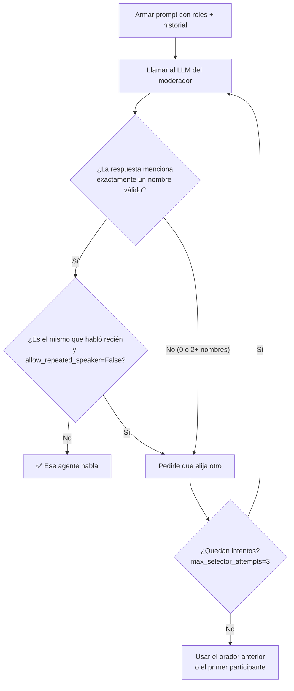

# Conceptos: cómo funciona un group chat en AutoGen

Este documento explica la teoría que necesitás para entender `debate_groupchat.py`.
Está pensado para leerse de arriba a abajo.

---

## 1. De un agente a un equipo

Un **agente** en AutoGen es un LLM con un rol fijo (su `system_message`) que recibe mensajes y
responde. Con un solo agente tenés, en esencia, un chatbot.

Un **group chat** (en AutoGen: un *team*) junta varios agentes en una **conversación
compartida**: todos ven el mismo historial y cada uno aporta desde su rol. Eso permite patrones que
un solo prompt no logra bien, como **proponer → criticar → corregir**.

La pregunta clave de cualquier group chat es:

> **¿Quién habla ahora?**

La respuesta la da el **Group Chat Manager**.

## 2. El Group Chat Manager

Es un componente interno del equipo que, en cada turno:

1. Mira el historial.
2. **Elige** al próximo orador.
3. Le pide que hable.
4. Agrega la respuesta al historial.
5. Revisa si hay que terminar (condición de fin o `max_turns`).

Lo que cambia entre tipos de equipo es **cómo elige** en el paso 2.

## 3. Estrategias de selección en AutoGen

| Equipo | Cómo elige al orador | Ejemplo de uso |
|---|---|---|
| `RoundRobinGroupChat` | Orden fijo: A → B → C → A… | Pipelines predecibles (escribir → revisar). |
| **`SelectorGroupChat`** ✅ | **Un LLM lee el contexto y decide.** | Debates, equipos con roles que se necesitan según la situación. |
| `Swarm` | El agente que habla decide a quién pasarle la posta (*handoff*). | Atención al cliente con derivaciones. |
| `MagenticOneGroupChat` | Un orquestador planifica y asigna tareas. | Tareas complejas con varios pasos. |

Este proyecto usa **`SelectorGroupChat`** porque el enunciado pide selección **dinámica según el
contexto**, no un orden fijo.

> 📝 **Nota histórica:** en AutoGen 0.2 (y en su fork AG2) esto se hacía con
> `GroupChat(speaker_selection_method="auto")` + `GroupChatManager`. En AutoGen 0.4+ esa misma
> idea se llama `SelectorGroupChat`: el *manager* sigue existiendo, pero lo crea el equipo por vos.

## 4. Cómo decide el moderador (paso a paso)

Cuando le toca elegir, `SelectorGroupChat` arma un prompt reemplazando tres marcadores en
`SELECTOR_PROMPT`:

| Marcador | Se reemplaza por | Ejemplo en este proyecto |
|---|---|---|
| `{roles}` | Una línea `nombre: description` por agente | `critico: Crítico: cuestiona los datos...` |
| `{participants}` | La lista de nombres válidos | `['investigador', 'critico']` |
| `{history}` | Los mensajes previos, en texto | `investigador: Las sanciones contra Rusia...` |

Después:

### ¿Por qué importa el `description` de cada agente?

Porque es **lo único que el moderador sabe** de cada participante (además del historial). El
`system_message` es privado del agente; el moderador no lo ve. Si dos agentes tienen descripciones
parecidas, el moderador va a elegir mal.

| Campo | Lo lee | Sirve para |
|---|---|---|
| `system_message` | El propio agente | Definir **cómo** se comporta y habla. |
| `description` | El moderador | Decidir **cuándo** conviene que hable. |

### Selección dinámica ≠ resultado variado

En la corrida de ejemplo el moderador alternó siempre investigador ↔ crítico. Eso **no** es
round-robin: fue una decisión del LLM en cada turno (lo prueban los `SelectSpeakerEvent`). Pasa
que, con las reglas de `SELECTOR_PROMPT`, cada mensaje suele dejar algo pendiente para el otro rol.
Si cambiás las reglas, cambia el patrón (ver [ejercicios](ejercicios.md)).

## 5. Eventos: cómo "ver" lo que pasa adentro

`team.run_stream(task=...)` devuelve un **stream asíncrono** de objetos. Los que usa este
proyecto:

| Objeto | Cuándo aparece | Qué tiene |
|---|---|---|
| `TextMessage` (`source="user"`) | Al inicio | El tema (`TOPIC`). |
| `SelectSpeakerEvent` | Antes de cada turno | `content`: lista con el/los nombre(s) elegidos. Solo aparece con `emit_team_events=True`. |
| `TextMessage` (`source=<agente>`) | Cuando un agente habla | `content`: el texto de la respuesta. |
| `TaskResult` | Al final | `messages` (todo) y `stop_reason` (por qué terminó). |

> ⚠️ Existe también `SelectorEvent`, pero solo se emite cuando el moderador usa streaming
> (`model_client_streaming=True`). En modo normal, la decisión llega como `SelectSpeakerEvent`.

## 6. ¿Cuándo termina?

Un equipo corre hasta que se cumple alguna de estas:

- **`max_turns`**: cantidad de intervenciones de agentes (acá, `MAX_TURNS=5`).
- **`termination_condition`**: reglas como `MaxMessageTermination(n)` o
  `TextMentionTermination("FIN")`. Se pueden combinar con `|` (o) y `&` (y).

Este proyecto usa solo `max_turns` para que el comportamiento sea predecible.

## 7. Glosario rápido

| Término | Significado |
|---|---|
| **Agente** | LLM + rol + (opcionalmente) herramientas. |
| **Team / group chat** | Varios agentes compartiendo una conversación. |
| **Group Chat Manager** | Componente que decide quién habla y cuándo terminar. |
| **Speaker selection** | La decisión de quién habla a continuación. |
| **Model client** | El objeto que sabe llamar a un proveedor de LLM (acá, Groq). |
| **Alucinación** | Cuando el LLM inventa datos que suenan plausibles pero son falsos. |
| **Fecha de corte** | Hasta cuándo llega el conocimiento del modelo. |
